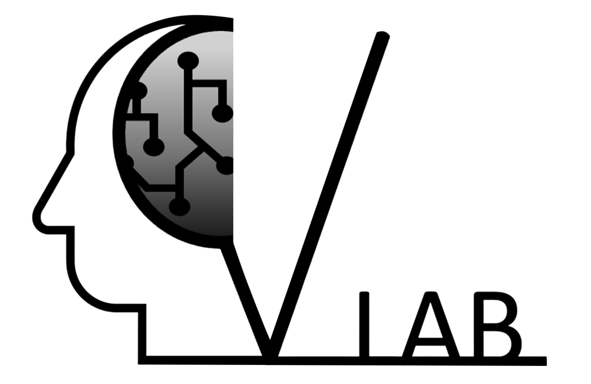
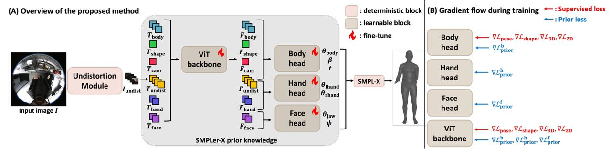

# Egocentric Whole-body Human Mesh Recovery with Prior-guided Learning 
<table align="center">
  <tr>
    <td style="vertical-align:middle; padding-right:10px;">
      
    </td>
    <td style="vertical-align:middle;">
      <b>Soyeon Na</b> &nbsp;&nbsp;
      <b>Seung Young Noh</b> &nbsp;&nbsp;
      <b>Ju Yong Chang</b>
    </td>
  </tr>
</table>

<p align="center">
  {nas006, kelvinnoh, jychang}@kw.ac.k
  <br>
  Dept. of ECE, Kwangwoon University, Seoul, Korea
</p>



## Installation

Install dependencies using `requirements.txt`:

```bash
pip install -r requirements.txt
```

## Configuration

Use the following config file for training:

- `config_ft_pesudogt.py`

When running training on a server, pass this file as `<CONFIG_FILE>`.


## Testing (SLURM)

To test on a SLURM cluster, run:

```bash
sh slurm_test.sh <JOB_NAME> <NUM_GPU> <TRAIN_OUTPUT_DIR> <CKPT_ID>
```

**Arguments**

- `<JOB_NAME>`: SLURM job name
- `<NUM_GPU>`: number of GPUs to use
- `<TRAIN_OUTPUT_DIR>`: directory where training outputs are saved (e.g., `outputs/exp01`)
- `<CKPT_ID>`: checkpoint identifier to evaluate (e.g., a step number)

**Example**

```bash
sh slurm_test.sh exp01 4 outputs/exp01 10000
```